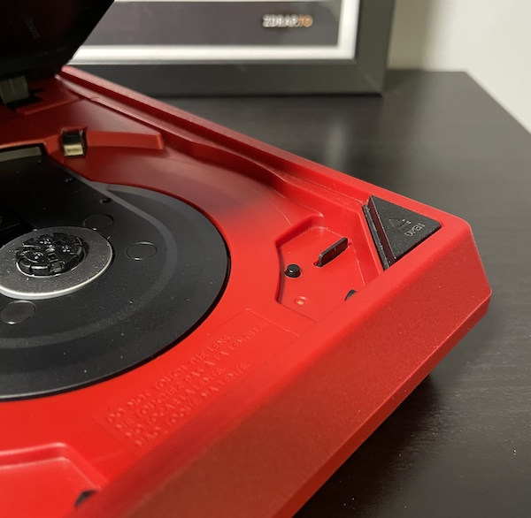
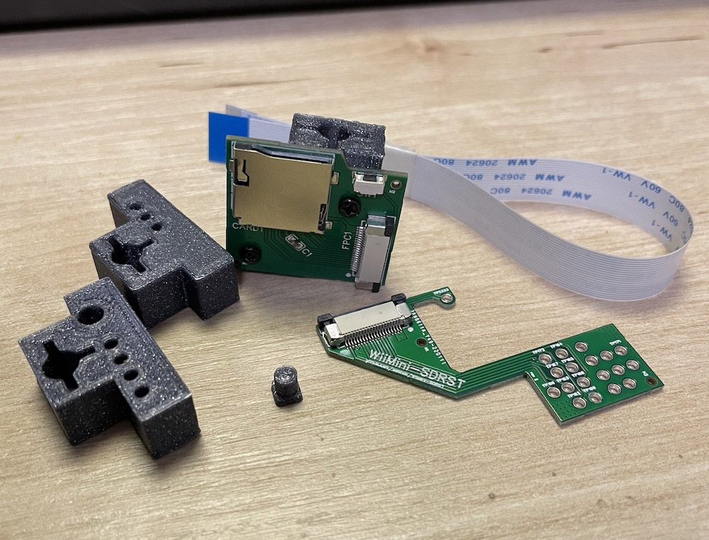

# WiiMini-SDRST
WiiMini-SDRST is a custom made mod that adds back microSD card and reset button to Wii Mini console.

Wii Mini is a great little console but it was seriously crippled by Nintendo to reduce manufacturing costs. They removed SD card and reset button from the console which made it less desirable for homebrew use. My kit helps you add these features back! It's very easy to install thanks to a nice quick solder board.

Join my Discord Server for support:

## 💪 Features
* supports microSD cards
* reset button let's you soft reset the console
* access to Priiloader after holding reset button during boot
* BootMii NAND dump and restore to/from microSD card
* compatibility with many homebrew apps not supporting USB storage

## 💵 Where I can buy one?
Head over to [my Tindie store](https://www.tindie.com/products/27355/) to buy it. By purchasing WiiMini-SDRST you sponsor all my future projects. 🙏

## 📃 Installation guide

Please head over to [the wiki](https://github.com/webhdx/WiiMini-SDRST/wiki) for full installation guide.

## 🧱 Kit contents
* PCBs:
  * extension port hookup PCB
  * main PCB containing microSD card slot and Reset button
* 3D printed parts:
  * support frame
  * button extension
  * 2 drill guides
* flex cable
